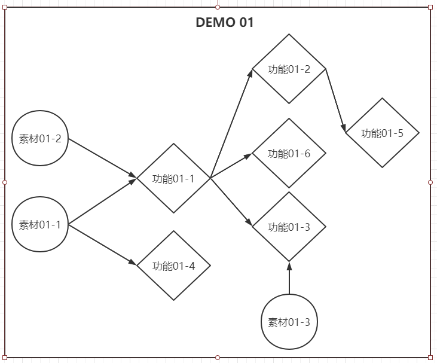

# 《聆》需求分析

**<u>移动距离以时间为比例</u>**

**<u>【所有预留的值于面板可见】</u>**

## DEMO 01 基础移动和跳跃

##### 功能01-1：方块自动往前滑动（添加一个浅色光拖尾）

- 两个方块以相同的水平速度v向右滑动
- 无需玩家手动控制
- <u>可以通过面板调节水平速度v的大小</u>
- 游戏开始时即开始向右滑动
- 预留可以停止滑动的一个bool值接口
  - 当 canMove = false的时候，两方块水平速度<u>同时</u>为0
- 拖尾颜色可以通过面板调整
- 拖尾材质导入项目工程文件夹防止材质缺失

##### 功能01-2：两个方块同速度同向不同重力方向移动<u>（保证x坐标相同）</u> 

- 在功能01-1的基础上，为两方块添加重力
- 白块重力竖直向上，黑块重力竖直向下
- 场景上添加水平跑道，两方块与跑道碰撞不会穿过跑道
- 两方块重力大小相等
- <u>当白块在黑块正下方时，两方块会互相支撑保持平衡不落地</u>

##### 功能01-3：方块开始移动的同时播放音乐 

- 在功能01-1的基础上，canMove = true方块开始移动的时候，播放BGM
- 音乐节奏、速度、音量在方块移动过程不改变
- 预留一个bool值接口，当isPlaying = false的时候BGM音量渐渐减小，音量为0时暂停播放

##### 功能01-4：两个不同的按键控制黑白块跳跃（点按跳跃固定高度，一段跳）

- <u>暂时</u>通过两个不同的按键控制黑白块跳跃
- 按键可以通过面板调整
- 每次跳跃高度相同
- 跳跃高度（力度）可以通过面板调整
- 两方块跳跃高度相同
- 只能从<u>跑道/平板/高台/阶梯</u>起跳，空中不能再跳跃
- 预留一个bool值接口，当正在跳跃过程时，isJump = true（便于添加动画）
- 同时按下两按键的时候两方块<u>同时跳跃</u>
- 响应速度快，无延迟

##### 功能01-5：界面UI显示并记录<u>移动距离</u>

- 根据UI草图完成UI的搭建
- 字体与效果图保持一致
- 以<u>时间*速度</u>计算移动距离
- <u>同一关卡的移动距离在不同设备上相同</u>
- UI上距离数值不断刷新
- 两方块分开计算移动距离，该数值在面板上可见
- 预留一个接口，当方块死亡时不计算距离，移动距离数值保持不变

##### 功能01-6：摄像机跟随两方块，<u>保证方块不超过竖直方向中线</u>

- 摄像机移动速度与方块移动速度基本保持一致
- 方块canMove = false的时候摄像机减速至停下
- 两方块在游戏画面中的位置位于画面偏左，不超过中线
- 方块跳跃时摄像机不随之上下抖动
- 摄像机范围参照效果图，与效果图保持一致
- 摄像机范围<u>不超过关卡范围</u>

**-----------------------------------------------------------------------------------------------------------------------------------------------------------**

##### 素材01-1：黑白方块图片  

##### 素材01-2：关卡地图图块  

##### 素材01-3：第一关音乐 

**-----------------------------------------------------------------------------------------------------------------------------------------------------------**

##### 设计01-1：第一关关卡设计草图

#### 时序图：

## DEMO 02 关卡搭建

##### 功能02-1：根据草图搭建关卡 

- 按照72*72的格子搭建关卡
- 保证关卡与草图完全一样
- 在DEMO02的基础上，测试关卡<u>设计合理性和与音乐节奏合拍性</u>

##### 功能02-2：判断死亡逻辑（尖刺、深渊、阶梯坎）（预留死亡特效接口）

- 方块<u>碰撞到尖刺、落入深渊、碰撞到墙面</u>死亡
- 预留一个bool值isDead，当方块死亡时isDead = true
- 碰撞后<u>立即</u>死亡
- 死亡后不销毁方块，仅设置不激活
- <u>注意：阶梯的上表面可以触碰，侧表面不能触碰</u>

##### 功能02-3：过关逻辑（到达终点，预留触发成功UI界面接口）

- 方块跑到关卡终点位置时过关
- 预留一个bool值isWin，当过关时isWin = true
- 添加过关动画，根据草图效果制作

##### 功能02-4：死亡粒子特效（破碎四散并上升光效）

- 根据设计效果制作粒子特效
- 死亡时播放特效后再重启关卡
- 特效作为一个预制体存在
- 该物体激活时播放特效，特效仅播放一次

##### 功能02-5：关卡重启逻辑（双方块均死亡粒子特效播放完成后从关卡开头生成，重置分数）

- 两方块均死亡时画面渐暗，渐亮时回到关卡开头
- 播放重新生成特效
- 重新开始播放BGM
- 分数重置为0

##### 功能02-6：存档点保存重新生成位置（存储存档点前的距离与附加分数）

- 方块到达存档点位置保存
- 如果某方块在到达下一个存档点前死亡，另一方块到达该存档点时死亡方块重新生成
- 对每一个存档点用物体规定生成位置
- 被复活的方块在继续开始计算移动距离

##### 功能02-7：重新生成特效（光粒聚合）

- 根据设计效果制作粒子特效
- 特效作为一个预制体存在
- 该物体激活时播放特效，特效仅播放一次
- 特效播放完成后生成方块

**-----------------------------------------------------------------------------------------------------------------------------------------------------------**

##### 素材02-1：方块落地音效

##### 素材02-2：死亡和重生粒子特效

## DEMO 03 关卡细节

##### 功能03-1：开始界面UI及功能（开始游戏、退出游戏）

- 根据UI效果图制作
- 点击开始游戏按钮进入关卡
- 点击退出游戏按钮退出
- 该界面<u>单独一个scene</u>
- 点击开始按钮<u>异步加载</u>关卡scene
- 从该界面到关卡界面<u>淡入淡出</u>

##### 功能03-2：暂停界面UI及功能（重启关卡、继续游戏、回到主菜单）

- 根据UI效果图制作
- 点击对应按钮可以重启关卡、继续游戏、回到主菜单
- 重启关卡与继续游戏时暂停界面UI<u>向下移出</u>
- 回到主菜单时画面<u>淡入淡出</u>

##### 功能03-3：暂停游戏按钮和UI呼出（呼出从下方弹出）

- 点击暂停按钮从下方弹出暂停界面
- 音乐淡出
- <u>继续游戏时音乐回到原来暂停时的位置播放</u>

##### 功能03-4：黑白方块完美碰撞交换效果

- 完美碰撞时触发动画
- 两方块旋转交换位置
- 重置跳跃机会
- 交换位置过程x方向速度大小不变

##### 功能03-5：过关以及失败界面UI及呼出（上方下落，包括距离、已获得的附加分数、关卡完成度，可以重启关卡和返回主菜单）

- 根据UI效果图制作
- 过关/失败动画播放完成后，UI从上方下落至画面中间
- UI界面包括距离、已获得的附加分数、关卡完成度
- 按钮包括重启关卡与返回主菜单

##### 功能03-6：存储过关/未过关数据（包括分数、完成度）

- 过关/失败时存储数据
- 过关时存储分数和已过关的100%完成度
- 失败时存储完成度

##### 功能03-7：方块落地音效添加

- 方块每次落地时触发音效
- 与BGM播放不冲突
- 同一个方块在一次音效未播放完时触发另一次音效则停止前一次音效播放
- 白块和黑块落地音效不互相覆盖

##### //功能03-8：当前分数大于历史分数显示“新纪录”

##### //功能03-9：黑白方块跨过中线反相（黑变白、白变黑）

**-----------------------------------------------------------------------------------------------------------------------------------------------------------**

##### 素材03-1：UI按钮图标（开始、暂停、退出、重启）

##### 素材03-2：UI设计（开始、暂停、过关、失败）